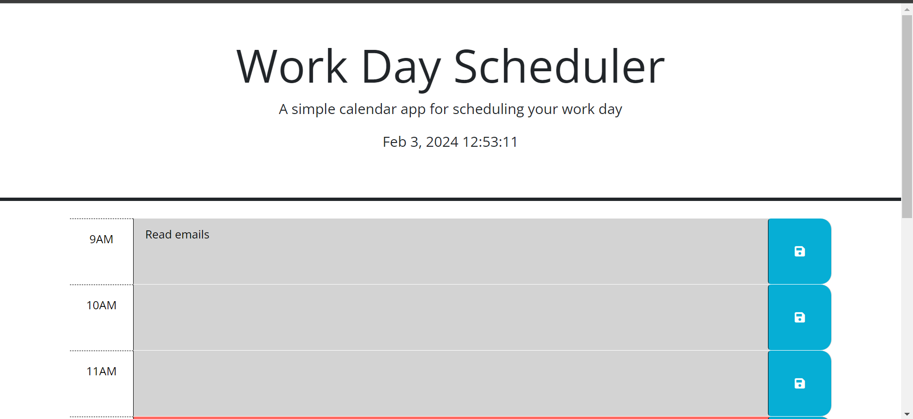

# workday-planner

## Description

The Work Day Scheduler is a simple calendar app designed to help users schedule their work day. It allows users to input tasks for specific hours of the day and save them for later reference.

## Table of Contents

- [Installation](#installation)
- [Image preview of the app](#image-preview-of-the-app)
- [Usage](#usage)
- [License](#license)
- [Contributing](#contributing)
- [Tests](#tests)
- [Questions](#questions)

## Installation

To install the Work Day Scheduler, simply clone this repository to your local machine:

```bash
git clone <repository-url>
```
## Image preview of the app



## Usage

To use the Work Day Scheduler, follow these steps:

1. Open the app in your web browser.
2. Enter your tasks for each hour of the work day.
3. Click the save button next to each task to save it.
4. The app will automatically update the time blocks to reflect past, present, or future hours based on the current time.
5. Tasks will be saved locally and will persist even if you close or refresh the page.

## License
This project is licensed under the MIT License

## Contributing

Contributions are welcome! Here are some guidelines:

- Fork the repository.
- Create your feature branch: git checkout -b feature/my-feature.
- Commit your changes: git commit -am 'Add my feature'.
- Push to the branch: git push origin feature/my-feature.
- Submit a pull request.

## Questions 
If you have any questions or need further assistance, feel free to reach out.

GitHub: [zaort](https://github.com/zaort)
email: [czafra.ortega@gmail.com](mailto:czafra.ortega@gmail.com)
